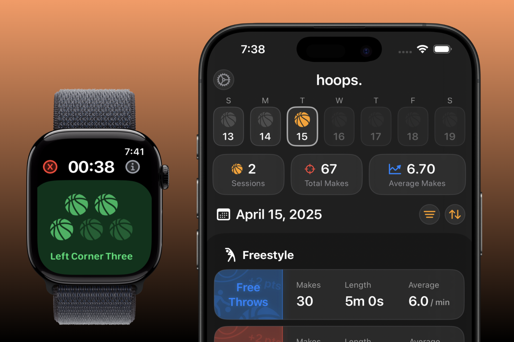

# 🏀 Hoops – Basketball Shot Tracking with Apple Watch

## 📱 Overview

Hoops is a basketball training companion app for iPhone and Apple Watch. It helps players improve their performance by tracking shooting sessions, recording makes by court zone, and visualizing shot data over time — all from the convenience of their wrist.

Designed for simplicity, speed, and clarity, Hoops is perfect for players who want serious insights with minimal distraction during practice.  

## 🖼️ UI

<p float="left">
  
</p>

## 🎯 Project Objectives

- Create a seamless iOS + Apple Watch experience for tracking basketball shots.
- Build a zone-based shooting system (e.g., layups, mid-range, free throws, 3PT).
- Use real-time interactions between iPhone and Watch to streamline workouts.
- Visualize shot history and performance breakdowns in a beautiful, intuitive UI.

## 🛠️ Technologies Used

- **Languages:** Swift
- **Frameworks:** SwiftUI, WatchKit
- **Persistence:** SwiftData & Codable storage (UserDefaults/Files)
- **Animation & Charts:** Swift Charts (for shot accuracy and breakdowns)
- **Project Type:** iOS + watchOS (paired app)
- **IDE:** Xcode

## 🧠 Key Learnings

- **Cross-Device Communication:** Built seamless syncing between iPhone and Apple Watch using `WatchConnectivity`.
- **Zone-Based Tracking:** Developed a custom data model for organizing shots by location.
- **SwiftUI Design:** Focused on elegant, minimalist UI with emphasis on glanceable data.
- **Progress Tracking:** Enabled historical views of user accuracy over multiple sessions.
- **Workout Efficiency:** Prioritized fast in-session inputs so the app never slows down shooting rhythm.

## 🚀 Getting Started

1. **Clone the repository:**

    ```bash
    git clone https://github.com/landonwest815/Hoops.git
    ```

2. **Open in Xcode:**
    - Make sure to open the `.xcworkspace` if present.
    - Ensure both iOS and watchOS targets are included when running.

3. **Run on Devices:**
    - Select your iPhone and paired Apple Watch targets.
    - Build and run to install on both devices.

4. **Start Shooting:**
    - Open Hoops on your Watch to begin logging shots by court zone.
    - Review session history, accuracy breakdowns, and improvement over time on your iPhone.

## 📌 Future Enhancements

- Add iCloud sync to preserve history across devices.
- Support for drills and structured workout modes.
